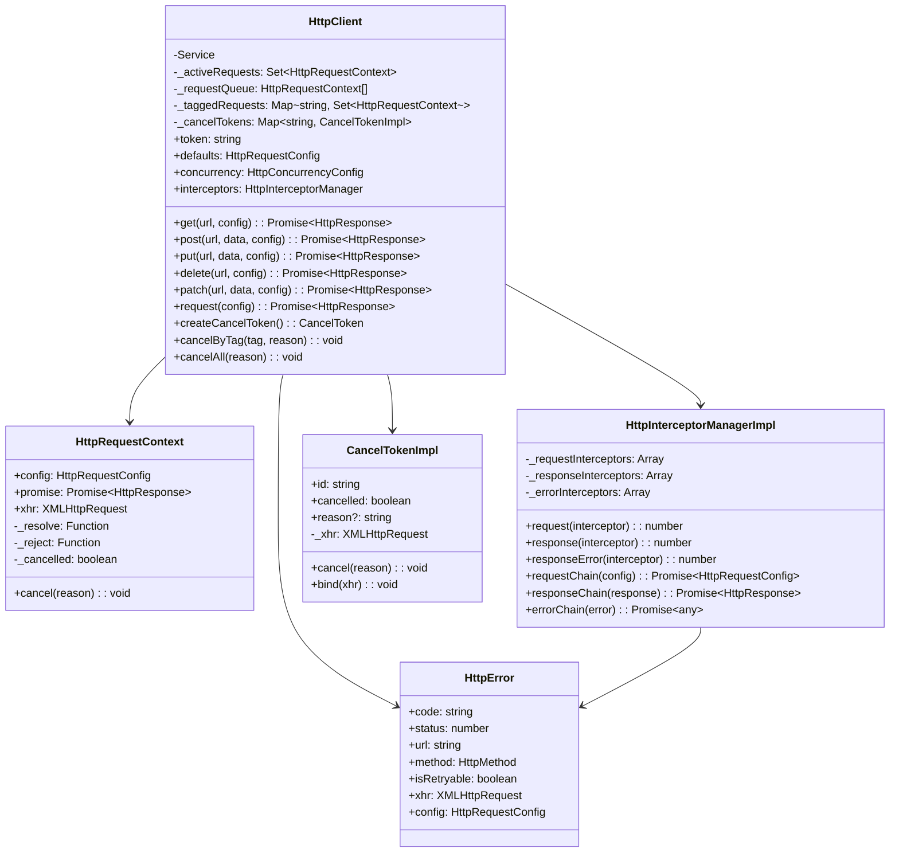
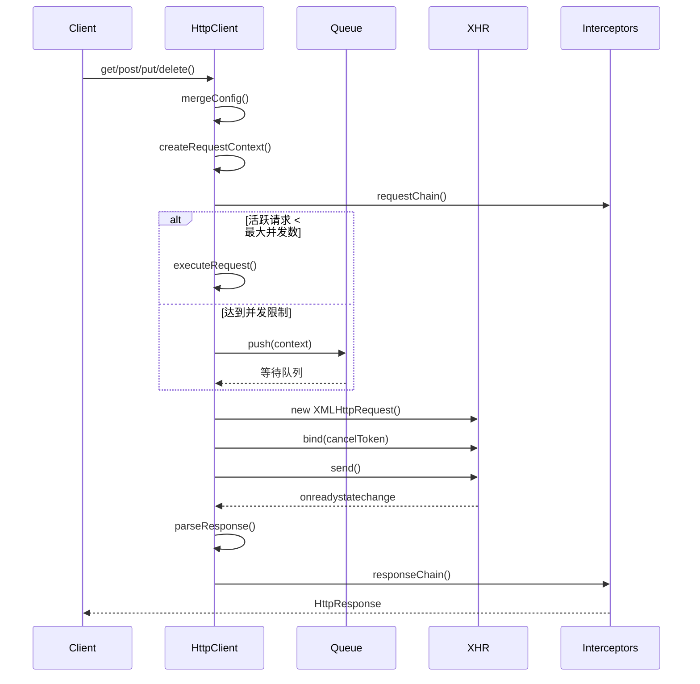

# HTTP 请求服务架构文档

## 概述

HTTP 请求服务是 Aaron 框架中用于处理网络请求的核心服务，基于 XMLHttpRequest 实现，确保在 Cocos Creator 支持的所有平台上都能正常工作。

## 设计原则

1. **跨平台兼容性**：使用 XMLHttpRequest 而非 fetch API
2. **高性能**：支持并发控制和请求队列管理
3. **可扩展性**：完整的拦截器系统
4. **健壮性**：内置错误处理和重试机制
5. **易用性**：提供简洁的 API 接口

## 核心架构

### 1. 类图结构



### 2. 模块结构

```
assets/scripts/aaron/
├── interfaces/
│   └── services/
│       ├── IHttp.ts          # HTTP 服务接口定义
│       └── IService.ts        # 基础服务接口
├── services/
│   └── HttpClient.ts         # HTTP 服务实现
└── macro/
    ├── Services.ts           # 服务常量
    └── Message.ts            # 日志消息
```

## 核心组件详解

### 1. HttpClient 类

负责整个 HTTP 请求服务的核心实现，继承自 Service 基类。

#### 主要属性

- `defaults`: 默认请求配置
- `concurrency`: 并发控制配置
- `interceptors`: 拦截器管理器
- `_activeRequests`: 活跃请求集合
- `_requestQueue`: 请求等待队列
- `_taggedRequests`: 标签映射
- `_cancelTokens`: 取消令牌映射

#### 核心方法

1. **请求方法**
   - `get()`: GET 请求
   - `post()`: POST 请求
   - `put()`: PUT 请求
   - `delete()`: DELETE 请求
   - `patch()`: PATCH 请求
   - `request()`: 通用请求方法

2. **生命周期管理**
   - `executeRequest()`: 执行请求
   - `performRequestWithRetry()`: 带重试的请求执行
   - `performRequest()`: 实际网络请求
   - `finishRequest()`: 完成请求处理

3. **并发控制**
   - 请求队列管理
   - 最大并发数限制
   - 自动队列处理

### 2. HttpRequestContext 类

请求上下文，管理单个请求的生命周期。

```typescript
class HttpRequestContext {
  public promise: Promise<HttpResponse>;
  public config: HttpRequestConfig;
  public xhr?: XMLHttpRequest;
  private _cancelled = false;

  constructor(config: HttpRequestConfig) {
    this.config = config;
    this.promise = new Promise((resolve, reject) => {
      this._resolve = resolve;
      this._reject = reject;
    });
  }
}
```

### 3. 拦截器系统

拦截器采用责任链模式，支持请求、响应和错误三种拦截器。

```typescript
interface HttpInterceptorManager {
  // 请求拦截器
  request(interceptor: HttpRequestInterceptor): number;
  ejectRequest(id: number): void;

  // 响应拦截器
  response(interceptor: HttpResponseInterceptor): number;
  ejectResponse(id: number): void;

  // 错误拦截器
  responseError(interceptor: HttpErrorInterceptor): number;
  ejectResponseError(id: number): void;

  // 链式执行
  requestChain(config: HttpRequestConfig): Promise<HttpRequestConfig>;
  responseChain<T>(response: HttpResponse<T>): Promise<HttpResponse<T>>;
  errorChain(error: any): Promise<any>;
}
```

### 4. 取消机制

基于 XMLHttpRequest 的 abort() 方法实现。

```typescript
interface CancelToken {
  readonly id: string;
  cancelled: boolean;
  reason?: string;
  cancel(reason?: string): void;
  bind(xhr: XMLHttpRequest): void;
}

class CancelTokenImpl implements CancelToken {
  private _xhr?: XMLHttpRequest;

  cancel(reason?: string): void {
    if (!this.cancelled && this._xhr) {
      this.cancelled = true;
      this.reason = reason;
      this._xhr.abort();
    }
  }

  bind(xhr: XMLHttpRequest): void {
    this._xhr = xhr;
    if (this.cancelled) {
      xhr.abort();
    }
  }
}
```

### 5. 错误处理

自定义 HttpError 类，提供详细的错误信息和重试判断。

```typescript
class HttpError extends Error {
  readonly code: HttpErrorCode;
  readonly status: number;
  readonly url: string;
  readonly method: HttpMethod;
  readonly isRetryable: boolean;
  readonly xhr?: XMLHttpRequest;
  readonly config: HttpRequestConfig;
}
```

## 请求流程

### 1. 请求执行流程



### 2. 重试机制

- 网络错误、超时错误：自动重试
- 5xx 服务器错误：自动重试（501 除外）
- 4xx 客户端错误：不重试
- 指数退避算法：1s, 2s, 4s...

### 3. 并发控制

- 使用 Set 管理活跃请求
- 使用数组作为等待队列
- 默认最大并发数：6
- 默认队列限制：100

## 配置系统

### 1. 默认配置

```typescript
public defaults: HttpRequestConfig = {
  url: '',
  route: '',
  method: HttpMethod.Get,
  timeout: 10000,
  retryCount: 3,
  retryDelay: 1000,
  responseType: 'json',
  withCredentials: false,
  headers: {
    'Content-Type': 'application/json',
  },
};
```

### 2. 并发配置

```typescript
public concurrency: HttpConcurrencyConfig = {
  maxConcurrent: 6,
  queueLimit: 100,
};
```

## 性能优化

### 1. 内存管理

- 请求完成后自动清理资源
- 取消请求时立即释放引用
- 使用 Map/Set 数据结构提高查找效率

### 2. 网络优化

- 智能重试机制
- 请求队列管理
- 支持请求取消
- 可配置的超时时间

### 3. 并发控制

- 限制同时进行的请求数量
- 避免网络拥塞
- 自动队列管理

## 扩展点

### 1. 自定义拦截器

```typescript
// 请求拦截器
httpClient.interceptors.request(async (config) => {
  // 修改请求配置
  return config;
});

// 响应拦截器
httpClient.interceptors.response(async (response) => {
  // 修改响应数据
  return response;
});

// 错误拦截器
httpClient.interceptors.responseError(async (error) => {
  // 统一错误处理
  return error;
});
```

### 2. 自定义错误处理

```typescript
class CustomHttpError extends HttpError {
  constructor(message: string, ...args) {
    super(message, ...args);
    // 自定义逻辑
  }
}
```

### 3. 扩展请求配置

通过 Partial<HttpRequestConfig> 可以轻松扩展新的配置项。

## 最佳实践

1. **使用拦截器**：统一处理认证、日志、错误等
2. **合理设置并发数**：根据应用场景调整 maxConcurrent
3. **使用标签管理**：为相关请求设置 tag，便于批量管理
4. **及时取消请求**：在组件销毁时取消未完成的请求
5. **错误处理**：根据 HttpError 的 isRetryable 判断是否需要重试

## 注意事项

1. 必须使用 XMLHttpRequest，不使用 fetch API
2. 不依赖 AbortController，使用自定义取消机制
3. 所有平台兼容：Web、iOS、Android、微信小游戏等
4. 遵循 Aaron 框架的设计模式和代码风格
5. 使用中文注释和文档