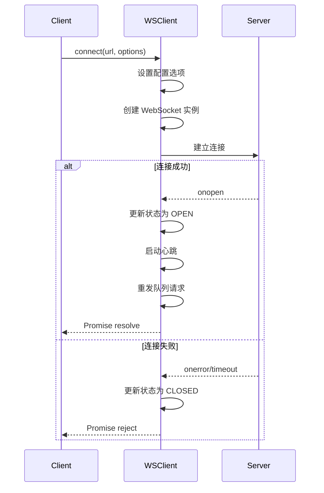
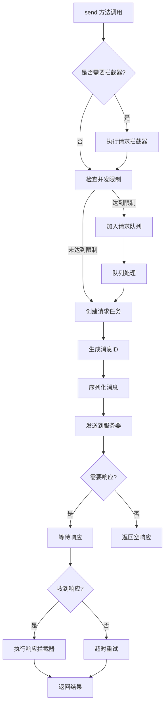
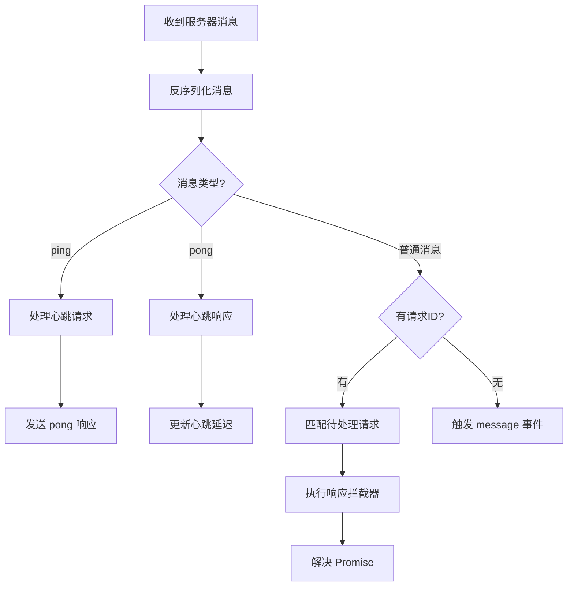
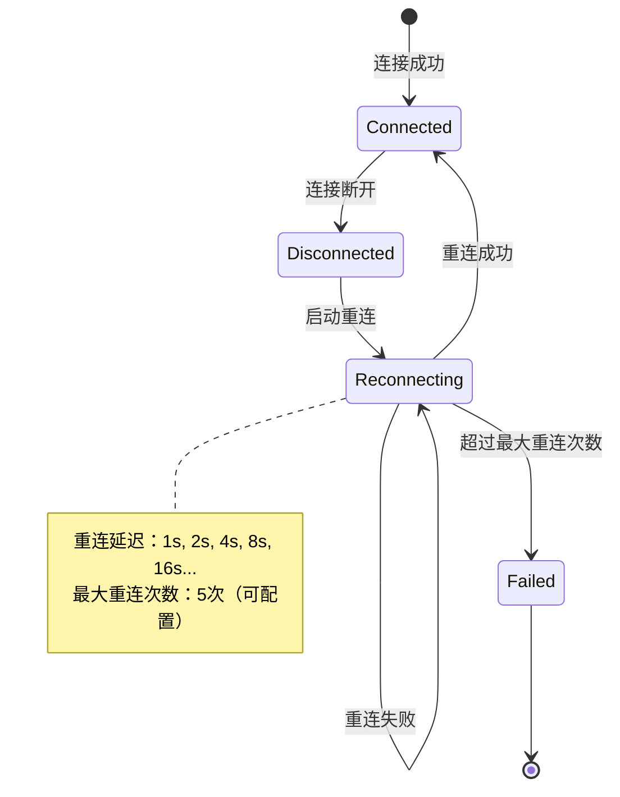
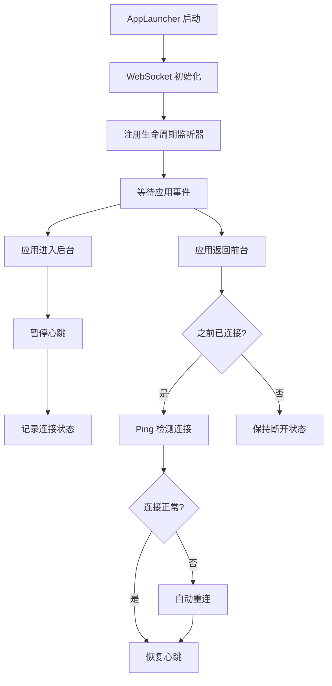

# WebSocket 服务架构文档

## 概述

Aaron 框架的 WebSocket 服务是一个功能完善的实时通信解决方案，提供了连接管理、消息收发、错误处理、重连机制、请求队列、生命周期管理等企业级功能。

## 核心架构

### 整体设计理念

```
┌─────────────────────────────────────────────────────────────┐
│                    WebSocket 服务架构                          │
├─────────────────────────────────────────────────────────────┤
│  应用层 (Application Layer)                                   │
│  ├─ 游戏逻辑                                              │
│  ├─ UI 交互                                              │
│  └─ 业务模块                                              │
├─────────────────────────────────────────────────────────────┤
│  服务接口层 (Service Interface Layer)                          │
│  ├─ IWebsocket (接口定义)                                   │
│  ├─ WSMessage (消息格式)                                    │
│  ├─ WSRequestConfig (请求配置)                              │
│  └─ WSResponse (响应格式)                                   │
├─────────────────────────────────────────────────────────────┤
│  服务实现层 (Service Implementation Layer)                      │
│  ├─ WebsocketClient (核心实现)                              │
│  ├─ 连接管理                                              │
│  ├─ 消息处理                                              │
│  ├─ 队列管理                                              │
│  ├─ 错误处理                                              │
│  └─ 生命周期管理                                            │
├─────────────────────────────────────────────────────────────┤
│  基础设施层 (Infrastructure Layer)                           │
│  ├─ 事件总线 (EventBus)                                     │
│  ├─ 日志系统 (Logger)                                       │
│  ├─ 服务容器 (ServiceContainer)                              │
│  └─ 应用启动器 (AppLauncher)                                │
└─────────────────────────────────────────────────────────────┘
```

### 核心组件

#### 1. 接口定义 (IWebsocket)

```typescript
export interface IWebsocket extends IService {
  // 连接状态
  readonly state: WSState;
  readonly isConnected: boolean;
  readonly url?: string;

  // 连接管理
  connect(url: string, options?: Partial<WSOptions>): Promise<void>;
  disconnect(code?: number, reason?: string): void;

  // 消息发送
  send<T>(config: WSRequestConfig): Promise<WSResponse<T>>;
  sendOneWay(message: WSMessage): void;
  sendBatch<T>(configs: WSRequestConfig[]): Promise<WSResponse<T>[]>;

  // 拦截器
  addRequestInterceptor(interceptor: WSRequestInterceptor): () => void;
  addResponseInterceptor(interceptor: WSResponseInterceptor): () => void;
  addErrorInterceptor(interceptor: WSErrorInterceptor): () => void;

  // 事件监听
  on<K extends keyof WSEventMap>(event: K, listener: (event: WSEventMap[K]) => void): () => void;
  once<K extends keyof WSEventMap>(event: K, listener: (event: WSEventMap[K]) => void): () => void;
  off<K extends keyof WSEventMap>(event: K, listener: (event: WSEventMap[K]) => void): void;

  // 状态管理
  getActiveRequestCount(): number;
  getPendingRequestCount(): number;
  clearPendingRequests(): void;
  checkConnection(): Promise<boolean>;
  getConnectionStats(): ConnectionStats;
}
```

#### 2. 核心实现类 (WebsocketClient)

```typescript
export class WebsocketClient extends Service implements IWebsocket {
  // 核心属性
  private _ws: WebSocket | null;
  private _state: WSState;
  private _options?: WSOptions;

  // 请求管理
  private _pendingRequests: Map<string, WSRequestTask>;
  private _requestQueue: WSRequestTask[];
  private _activeRequests: number;

  // 拦截器
  private _requestInterceptors: WSRequestInterceptor[];
  private _responseInterceptors: WSResponseInterceptor[];
  private _errorInterceptors: WSErrorInterceptor[];

  // 定时器
  private _reconnectTimer?: number;
  private _heartbeatTimer?: number;
  private _heartbeatTimeoutTimer?: number;

  // 生命周期
  private _connectionStateBeforeBackground: boolean;
  private _lastConnectionCheckTimestamp: number;
}
```

## 关键功能设计

### 1. 连接管理

#### 连接状态机

```
    [CLOSED]
        │
        ▼
    [CONNECTING] ──► [CONNECTING_TIMEOUT]
        │                     │
        ▼                     ▼
    [OPEN] ──► [CLOSING] ──► [CLOSED]
        │                     ▲
        ▼                     │
    [ERROR] ──────────────────┘
```

#### 连接建立流程



### 2. 消息处理架构

#### 消息发送流程



#### 消息接收流程



### 3. 队列管理机制

#### 请求队列设计

```
┌─────────────────────────────────────────────────────────────┐
│                     请求队列管理                              │
├─────────────────────────────────────────────────────────────┤
│  发送请求                                                   │
│  │                                                          │
│  ├─ 检查活跃请求数 < maxConcurrency                         │
│  │  └─ 是 → 直接发送                                        │
│  │  └─ 否 → 加入请求队列                                    │
│  │                                                          │
│  ├─ 请求完成/失败                                          │
│  │  └─ 处理队列中的下一个请求                               │
│  │                                                          │
│  └─ 连接断开                                               │
│     ├─ retainPendingRequests = true                        │
│     │  └─ 保留队列，重连后重发                             │
│     └─ retainPendingRequests = false                       │
│        └─ 清空队列，拒绝所有请求                            │
└─────────────────────────────────────────────────────────────┘
```

### 4. 重连机制

#### 自动重连策略



#### 重连实现逻辑

```typescript
private _scheduleReconnect(): void {
  if (this._reconnectAttempts >= this._options.maxReconnectAttempts) {
    this.logger.ef(MESSAGES.WEBSOCKET.RECONNECT_FAILED, this._options.maxReconnectAttempts);
    return;
  }

  this._reconnectAttempts++;
  const delay = this._options.reconnectDelay * Math.pow(2, this._reconnectAttempts - 1);

  this._reconnectTimer = setTimeout(async () => {
    try {
      await this._connect();
      this.logger.i(literal.fmt(MESSAGES.WEBSOCKET.RECONNECTED, this._reconnectAttempts));
    } catch (error) {
      this._scheduleReconnect(); // 指数退避重试
    }
  }, delay);
}
```

### 5. 心跳机制

#### 心跳流程

```
客户端                                    服务器
  │                                        │
  │ ◄───────────── 连接建立 ───────────────► │
  │                                        │
  │ ─── 发送 heartbeat (timestamp) ──────► │
  │                                        │
  │ ◄─── 发送 heartbeat (timestamp) ─────── │
  │                                        │
  │ 计算延迟 = currentTime - timestamp      │
  │                                        │
  │ ─── 等待 heartbeatInterval ───────────► │
  │                                        │
  │ (重复循环)                              │
```

### 6. 生命周期管理

#### 应用生命周期集成



## 配置选项详解

### WSOptions 配置接口

```typescript
interface WSOptions {
  // 基础配置
  url: string;                          // 服务器地址
  protocols?: string | string[];        // WebSocket 协议

  // 性能配置
  maxConcurrency: number = 10;          // 最大并发请求数
  enableCompression: boolean = false;   // 启用消息压缩

  // 重连配置
  autoReconnect: boolean = true;        // 自动重连
  maxReconnectAttempts: number = 5;    // 最大重连次数
  reconnectDelay: number = 1000;        // 重连基础延迟

  // 心跳配置
  heartbeatInterval: number = 30000;    // 心跳间隔（30秒）
  heartbeatTimeout: number = 5000;      // 心跳超时（5秒）

  // 请求管理
  retainPendingRequests: boolean = true;      // 保留未发送请求
  autoRetryPendingRequests: boolean = true;  // 自动重发请求

  // 超时配置
  connectTimeout: number = 10000;       // 连接超时（10秒）
  timeout: number = 5000;               // 请求超时（5秒）

  // 自定义解析器
  parser?: {
    stringify: (message: WSMessage) => string;
    parse: (data: string) => WSMessage;
  };
}
```

## 错误处理体系

### 错误类型定义

```typescript
export enum WSErrorCodes {
  NETWORK_ERROR = 'NETWORK_ERROR',           // 网络错误
  CONNECT_TIMEOUT = 'CONNECT_TIMEOUT',       // 连接超时
  REQUEST_TIMEOUT = 'REQUEST_TIMEOUT',       // 请求超时
  CONNECTION_REFUSED = 'CONNECTION_REFUSED', // 连接被拒绝
  CONNECTION_CLOSED = 'CONNECTION_CLOSED',   // 连接关闭
  PARSE_ERROR = 'PARSE_ERROR',             // 解析错误
  REQUEST_CANCELLED = 'REQUEST_CANCELLED',   // 请求被取消
  CONCURRENCY_LIMIT_EXCEEDED = 'CONCURRENCY_LIMIT_EXCEEDED', // 并发限制
  AUTH_FAILED = 'AUTH_FAILED',             // 认证失败
  SERVER_ERROR = 'SERVER_ERROR',           // 服务器错误
  UNKNOWN_ERROR = 'UNKNOWN_ERROR',         // 未知错误
}
```

### 错误处理流程

```
发生错误
    │
    ├─ 是否为 WSError？
    │  ├─ 是 → 直接抛出
    │  └─ 否 → 包装为 WSError
    │
    ├─ 执行错误拦截器链
    │  ├─ 拦截器1 → 拦截器2 → 拦截器3
    │  └─ 每个拦截器可以修改错误信息
    │
    ├─ 错误分类处理
    │  ├─ 连接错误 → 触发重连
    │  ├─ 超时错误 → 重试请求
    │  ├─ 解析错误 → 记录日志
    │  └─ 其他错误 → 向上抛出
    │
    └─ 错误恢复
       ├─ 自动重连
       ├─ 请求重试
       ├─ 降级处理
       └─ 用户提示
```

## 拦截器系统

### 拦截器类型

```typescript
// 请求拦截器
export interface WSRequestInterceptor {
  (config: WSRequestConfig): WSRequestConfig | Promise<WSRequestConfig>;
}

// 响应拦截器
export interface WSResponseInterceptor {
  (response: WSResponse): WSResponse | Promise<WSResponse>;
}

// 错误拦截器
export interface WSErrorInterceptor {
  (error: WSError): WSError | Promise<WSError>;
}
```

### 拦截器执行顺序

```
发送请求：
原始配置 → 请求拦截器1 → 请求拦截器2 → ... → 发送到服务器

接收响应：
服务器响应 → 响应拦截器1 → 响应拦截器2 → ... → 返回给调用者

处理错误：
原始错误 → 错误拦截器1 → 错误拦截器2 → ... → 抛出给调用者
```

### 常见拦截器用例

```typescript
// 1. 认证拦截器
wsClient.addRequestInterceptor(async (config) => {
  config.meta = {
    ...config.meta,
    token: await getAuthToken()
  };
  return config;
});

// 2. 日志拦截器
wsClient.addRequestInterceptor((config) => {
  console.log('发送请求:', config.message.type);
  return config;
});

// 3. 错误重试拦截器
wsClient.addErrorInterceptor(async (error) => {
  if (error.code === WSErrorCodes.SERVER_ERROR) {
    // 服务器错误时等待更长时间重试
    await new Promise(resolve => setTimeout(resolve, 2000));
  }
  return error;
});
```

## 性能优化

### 1. 连接池管理

```typescript
class WebSocketPool {
  private connections: Map<string, WebSocket[]> = new Map();
  private maxConnectionsPerUrl: number = 5;

  async getConnection(url: string): Promise<WebSocket> {
    // 从连接池获取可用连接
    // 如果没有可用连接，创建新连接
    // 超过最大连接数时，等待或复用
  }
}
```

### 2. 消息批处理

```typescript
class MessageBatcher {
  private batch: WSMessage[] = [];
  private batchTimer?: number;
  private batchSize: number = 10;
  private batchTimeout: number = 100;

  send(message: WSMessage) {
    this.batch.push(message);

    if (this.batch.length >= this.batchSize) {
      this.flush();
    } else if (!this.batchTimer) {
      this.batchTimer = setTimeout(() => this.flush(), this.batchTimeout);
    }
  }

  private flush() {
    if (this.batch.length > 0) {
      const messages = this.batch.splice(0);
      this.wsClient.sendBatch(messages.map(msg => ({ message: msg })));
    }
    clearTimeout(this.batchTimer);
    this.batchTimer = undefined;
  }
}
```

### 3. 内存管理

```typescript
// 定期清理过期的请求任务
setInterval(() => {
  const now = Date.now();
  for (const [id, task] of this._pendingRequests) {
    if (now - task.timestamp > 300000) { // 5分钟
      task.cancel();
      this._pendingRequests.delete(id);
    }
  }
}, 60000); // 每分钟清理一次
```

## 安全考虑

### 1. 认证机制

```typescript
// 连接时认证
await wsClient.connect('ws://server.com', {
  protocols: ['auth-token', getAuthToken()]
});

// 消息级认证
wsClient.addRequestInterceptor(async (config) => {
  const signature = await signMessage(config.message);
  config.meta = { ...config.meta, signature };
  return config;
});
```

### 2. 数据加密

```typescript
const encryptionParser = {
  stringify: (message: WSMessage) => {
    const json = JSON.stringify(message);
    return encrypt(json, getEncryptionKey());
  },
  parse: (data: string) => {
    const json = decrypt(data, getEncryptionKey());
    return JSON.parse(json);
  }
};

await wsClient.connect('ws://server.com', {
  parser: encryptionParser
});
```

### 3. 速率限制

```typescript
class RateLimiter {
  private requests: number[] = [];
  private maxRequests: number = 100;
  private timeWindow: number = 60000; // 1分钟

  checkLimit(): boolean {
    const now = Date.now();
    this.requests = this.requests.filter(time => now - time < this.timeWindow);

    if (this.requests.length >= this.maxRequests) {
      throw new WSError(WSErrorCodes.CONCURRENCY_LIMIT_EXCEEDED, '请求频率过高');
    }

    this.requests.push(now);
    return true;
  }
}
```

## 监控和调试

### 1. 连接状态监控

```typescript
interface ConnectionStats {
  state: WSState;
  isConnected: boolean;
  activeRequests: number;
  pendingRequests: number;
  queuedRequests: number;
  reconnectAttempts: number;
  lastHeartbeat: number;
  avgLatency: number;
  totalMessages: number;
  errorCount: number;
}

// 定期收集统计信息
const monitor = setInterval(() => {
  const stats = wsClient.getConnectionStats();
  console.log('WebSocket 状态:', stats);

  // 发送到监控系统
  sendMetrics(stats);
}, 10000);
```

### 2. 调试工具

```typescript
class WebSocketDebugger {
  private logs: Array<{ timestamp: number; type: string; data: any }> = [];

  log(type: string, data: any) {
    const entry = { timestamp: Date.now(), type, data };
    this.logs.push(entry);

    // 保持最近 1000 条日志
    if (this.logs.length > 1000) {
      this.logs.shift();
    }
  }

  exportLogs(): string {
    return JSON.stringify(this.logs, null, 2);
  }

  filterLogs(type: string) {
    return this.logs.filter(log => log.type === type);
  }
}
```

## 最佳实践

### 1. 初始化配置

```typescript
// 推荐的生产环境配置
const productionConfig: Partial<WSOptions> = {
  maxConcurrency: 20,              // 根据服务器能力调整
  autoReconnect: true,
  maxReconnectAttempts: 10,        // 生产环境增加重试次数
  reconnectDelay: 2000,            // 增加基础延迟
  heartbeatInterval: 30000,        // 30秒心跳
  heartbeatTimeout: 10000,         // 10秒超时
  connectTimeout: 15000,           // 15秒连接超时
  retainPendingRequests: true,
  autoRetryPendingRequests: true,
  enableCompression: true,         // 启用压缩
};

await wsClient.connect(wsUrl, productionConfig);
```

### 2. 错误处理

```typescript
// 全局错误处理
wsClient.addErrorInterceptor(async (error) => {
  // 记录错误
  errorLogger.log(error);

  // 发送错误报告
  if (error.code === WSErrorCodes.SERVER_ERROR) {
    reportError(error);
  }

  // 显示用户友好提示
  showUserError(getUserErrorMessage(error));

  return error;
});
```

### 3. 优雅关闭

```typescript
class GameNetwork {
  async shutdown() {
    try {
      // 等待所有重要请求完成
      const stats = wsClient.getConnectionStats();
      if (stats.activeRequests > 0) {
        console.log(`等待 ${stats.activeRequests} 个请求完成...`);
        await this.waitForRequestsComplete(5000); // 最多等待5秒
      }

      // 主动断开连接
      wsClient.disconnect(1000, 'Game shutdown');

    } catch (error) {
      console.error('关闭连接时出错:', error);
    }
  }
}
```

## 总结

Aaron 框架的 WebSocket 服务提供了企业级的实时通信解决方案，具有以下特点：

1. **完整的连接管理**：自动重连、心跳检测、生命周期集成
2. **强大的请求处理**：并发控制、队列管理、自动重试
3. **灵活的拦截器系统**：请求/响应/错误拦截器
4. **完善的错误处理**：错误分类、自动恢复、用户提示
5. **高性能设计**：连接池、消息批处理、内存管理
6. **安全性保障**：认证机制、数据加密、速率限制
7. **易于监控调试**：状态统计、日志记录、调试工具

该服务适用于各种实时通信场景，包括游戏、聊天、实时数据同步等。通过合理的配置和使用，可以构建稳定、高效的实时应用。